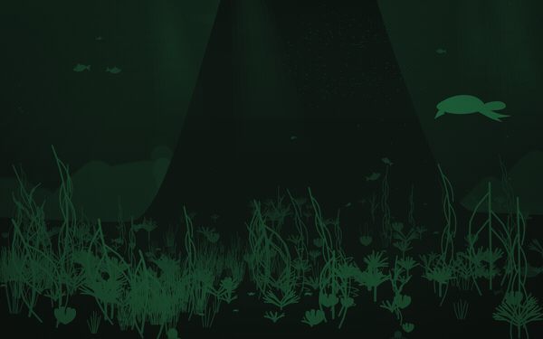

# CodinCod for Omarchy

A dark green desktop, and a sea living in the wallpaper.



The theme is [CodinCod](https://codincod.com)'s own palette, converted out of
oklch so a green here is the same green there. The wallpaper is the website's
own simulation, running on a desktop.

## Installing it

```bash
omarchy theme install https://github.com/reeveng/codincod-theme.git
```

That is the whole of the theme. Omarchy takes `colors.toml` and generates the
rest, so this one file re-colours alacritty, foot, kitty, ghostty, btop, helix,
neovim, vscode, chromium, obsidian, the lock screen, Hyprland's borders, the
bar, and the keyboard's own lights.

The sea is a second step, and the theme is complete without it:

```bash
./install.sh
```

The clip above is the plugin itself, recorded offscreen a frame at a time. It
is slower and darker on a real desktop, which is the point of it.

### Where the colours come from

| Here | There |
| --- | --- |
| `background` | the colour a puzzle is written on, from `editor/themes/forest.ts` |
| `darker_background` | daisyUI's `base-100`, the surface under the whole site |
| `accent` | the site's `primary` |
| `red`, `yellow`, `green`, `cyan`, `blue` | the site's `error`, `warning`, `success`, `secondary`, `info` |

The hues and their chroma are the site's; only the lightness is moved, onto a
ladder a terminal can use. `orange` and `brown` have no counterpart on the
website and were placed on the same ladder to match.

## The sea

The desktop background is a body of water: a shoal working through it, marine
snow falling, bubbles off vents in the floor, and light through the surface.
Hills stand off in the murk, plants root on the ground at their own distance
rather than along one line, and a fish that swims out of the picture is gone, so
nothing loops.

```bash
./install.sh
```

That builds `seascape-rs/`, which draws the water on the graphics card, and
starts it as a service of your session. It wants `cargo`, and the first build
takes a few minutes. The water is drawn in this theme's own two colours, which
`SEASCAPE_INK=` and `SEASCAPE_SURFACE=` at install time will change.

It turns off every wallpaper the shell would otherwise draw, since two of them
on the background layer is a coin toss over which one you see. `systemctl --user
disable --now seascape.service` and `omarchy plugin enable omarchy.background`
is the way back to the wallpaper you had.

**A different sea every day.** The calendar day decides where the seabed is,
what grows on it, how much of it grew, whether there is a wreck down there and
what happens to be lying on it. A screen takes the new day up the next time a
window covers it, so the ground never rearranges itself while you are looking at
it.

**And almost nothing happens in it.** A boat crosses the surface, sonar goes off
somewhere out there, and once in a while a submarine passes at your own depth,
each at most once a day and the submarine rarely. Turtles, sharks, dolphins and
rays come through on their own clock, minutes apart rather than hours. Nothing
advances while the wallpaper is covered, so a crossing owed at four in the
morning happens the next time you are actually looking at the sea.

**It is the website's own simulation.** Nothing in it is reimplemented here.
`assets/js/ornament/` in the CodinCod repository is kept free of the DOM so that
a renderer other than a browser can exist at all, and both of the ones here run
it: where every fish is and what shape the moon is tonight are decided in the
same TypeScript the porthole on the site runs.

```bash
CODINCOD_DIR=/path/to/codincodv2 seascape/build-ornament.sh   # for the plugin
seascape-rs/js/build.sh                                       # for the native one
```

Both are bundles of the same directory, and both are committed, so neither is
needed to install anything. The native one imports the ornament by a path
rather than through a shim, so rebuilding it wants the CodinCod repository
checked out beside this one.

### Two renderers

| | `seascape-rs/` | `seascape/` |
| --- | --- | --- |
| What it is | Rust, wgpu and V8, on a layer surface of its own | an Omarchy shell plugin, in QML |
| How it draws | triangles cut on the processor, coloured and bent on the card | Qt's curve renderer, a `Shape` a thing |
| A frame at 2560x1440 | about 20ms | about 54ms |
| Screens | all of them, each at its own density | all of them |
| Installed by | `./install.sh` | `./install.sh --qml` |

The native one is what this installs. The plugin is where the water started, it
is the reference the native one is held against, and it is what to fall back to
on a machine that will not build Rust.
Whichever is installed turns the other off, since two wallpapers on the
background layer is a coin toss over which one you see.

[SEASCAPE.md](SEASCAPE.md) is the long version: what each layer draws, the rules
the whole scene keeps, what a frame costs on either renderer, and how the two
are held against each other.

### Looking at it without a desktop

The background is only visible when nothing is on the workspace, so
screenshotting it would mean throwing yourself onto an empty workspace and back.
The same component mounts offscreen instead:

```bash
cd seascape && ./look.sh preview.qml     # a still, into seascape/preview.png
cd seascape && ./look.sh shapes.qml      # every silhouette, large and alone
cd seascape && ./gif.sh                  # eight seconds of it, as a gif
cd seascape && ./bench.sh                # where a frame goes

# And the same still off the native renderer, on the same sea and the same hour.
cd seascape-rs && cargo run --release -- seed=7 daylight=1 march=0.3 out=/tmp/sea.png
cd seascape-rs && cargo run --release -- frames=200   # where a frame goes there
```

`preview.png` at the top of this repository is the same sheet written a
directory up, which is where Omarchy's theme picker looks for one.

Through `look.sh` rather than `qml6`, and that is not a convenience:
`QT_QPA_PLATFORM=offscreen` by itself loads Qt's software scene graph, which
ignores `preferredRendererType` altogether and answers every question about a
renderer the desktop never runs.

## Making windows opaque

Omarchy fades unfocused windows, and this theme is drawn on the assumption that
nothing is see-through. In `~/.config/hypr/looknfeel.lua`:

```lua
o.window(".*", { opacity = "1 1" })
```

Loaded after Omarchy's defaults, and the last window rule to match is the one
Hyprland keeps.

## Licence

MIT. See [LICENSE](LICENSE).
