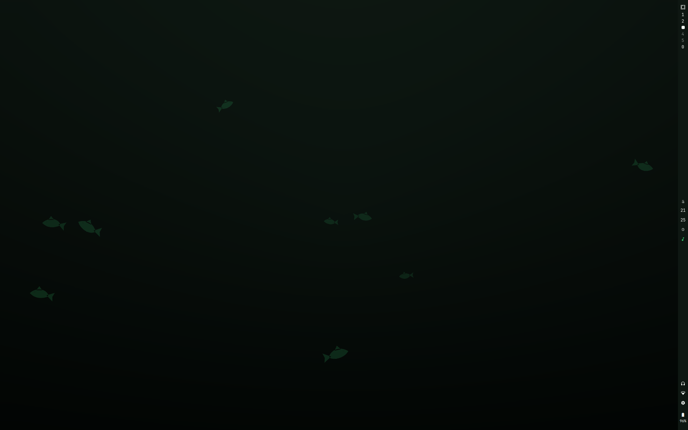

# CodinCod for Omarchy

A dark green desktop, and a sea living in the wallpaper.

The theme is [CodinCod](https://codincod.com)'s own palette, converted out of
oklch so a green here is the same green there. The wallpaper is the shoal from
the website, running the website's simulation, on a desktop.



## The theme

```bash
omarchy theme install https://github.com/reeveng/codincod-theme.git
```

That is the whole of it. Omarchy takes `colors.toml` and generates the rest, so
this one file re-colours alacritty, foot, kitty, ghostty, btop, helix, neovim,
vscode, chromium, obsidian, the lock screen, Hyprland's borders, the bar, and
the keyboard's own lights.

### Where the colours come from

| Here | There |
| --- | --- |
| `background` | the colour a puzzle is written on, from `editor/themes/forest.ts` |
| `darker_background` | daisyUI's `base-100`, the surface under the whole site |
| `accent` | the site's `primary` |
| `red`, `yellow`, `green`, `cyan`, `blue` | the site's `error`, `warning`, `success`, `secondary`, `info` |

The hues and their chroma are the site's; only the lightness is moved, onto a
ladder a terminal can use. `orange` and `brown` have no counterpart on the
website and were placed on the same ladder to match.

## The sea


`seascape/` is an Omarchy shell plugin that replaces the desktop background
with water: a shoal working through it, marine snow falling, bubbles coming off
vents in the floor, and light through the surface. Hills stand off in the murk,
plants root on the ground at their own distance rather than along one line, and
a fish that swims out of the picture is gone: the one that comes in next is a
new animal, so nothing loops.

That clip is the plugin itself, rendered offscreen a frame at a time. It is
slower and darker on a real desktop, which is the point of it.

```bash
./install.sh
```

It is optional, and the theme is complete without it.

### And almost nothing happens in it

A boat crosses the surface, sonar goes off somewhere out there, and once in a
while a submarine passes at your own depth. Each of them at most once a day, at
an hour the day decides, and the submarine only on about one day in seven. They
wait for somebody: the water advances only while the wallpaper is uncovered, so
a crossing that was owed at four in the morning happens the next time you are
actually looking at the sea.

### A different sea every day

The seabed is the calendar day's: the same place from one midnight to the next,
and somewhere else tomorrow. Which stones, which plants, whether there is a
wreck on the floor and what happens to be lying on it are all that one number's
doing. A screen takes the new day up the next time
a window covers it, so the ground never rearranges itself while you are looking
at it.

### It runs on the website's own simulation

The shoal is not reimplemented here. `Ornament.js` is built by
`seascape/build-ornament.sh` out of `assets/js/ornament/` in the CodinCod
repository, and nothing in that directory is edited on the way through:

| There | Here |
| --- | --- |
| `shoal.ts` | where a fish goes, why, and which of five kinds it is |
| `fish_shape.ts` | one drawing of the animal, per beat of its tail |
| `cephalopods.ts` | squid in the water, octopuses on the stones |
| `seabed.ts`, `flora.ts` | the ground at every distance, and what grows out of it |
| `relics.ts` | what lies on the floor, and the plume off the vent |
| `passers.ts` | the boat overhead, the sonar, and the submarine |
| `drift.ts`, `rays.ts` | the snow, the bubbles, the light |
| `sun.ts` | which hour it is, from the sun's real altitude |
| `perlin.ts` | the field they all read |
| `water.ts` | the browser's renderer, which `Seascape.qml` replaces |

That split is the website's own and it is deliberate: the simulations are kept
free of the DOM so the drawing half stays a drawing half. A second renderer is
what that buys.

```bash
CODINCOD_DIR=/path/to/codincodv2 seascape/build-ornament.sh
```

### It costs nothing while you work

The scene advances only while the wallpaper is actually visible, which it asks
Hyprland about rather than guesses: if any window is on this screen's active
workspace, nothing moves. `Hyprland.toplevels` is fed by the compositor's event
socket, so that answer is recomputed when a window opens, closes or changes
workspace, and at no other time.

That gate assumes what this theme assumes: no gaps, and no see-through windows.
If you run either, it will park a sea you can still see. `looknfeel.lua` in the
[install notes](#making-windows-opaque) turns opacity off.

### Looking at it without a desktop

Because the background is only visible when nothing is on the workspace,
screenshotting it means throwing yourself onto an empty workspace and back. So
there is a harness that mounts the same component offscreen:

```bash
cd seascape && ./look.sh preview.qml
```

It writes `preview.png` and exits. For a moving one, `record.qml` steps the
same component by hand and grabs every frame, so a clip comes out at the rate
it was asked for however long each grab took:

```bash
cd seascape && ./look.sh record.qml \
  out=/tmp/frames frames=240 fps=20 width=1280 height=800 settle=90
```

`shapes.qml` is the third sheet, and it draws every shape in the scene large
and on its own, which is the only way to tell a drawing that is wrong from a
drawing that is merely small.

`gif.sh` is those frames and ffmpeg, and it is what the clip at the top of this
page comes out of:

```bash
cd seascape && ./gif.sh                        # sea.gif, eight seconds of it
cd seascape && ./gif.sh seed=42 daylight=0 march=0.2 wide=900 out=night.gif
```

It records larger than it writes and scales down, which is the only
antialiasing the curve renderer has, and it takes the film and the camera's
wander off first: both change every pixel in the picture every frame, and a gif
stores what changed. The script says what that is worth in the file.

All the sheets go through `look.sh` rather than `qml6`, and that is not a
convenience. `QT_QPA_PLATFORM=offscreen` by itself loads Qt's software scene
graph, which paints with QPainter and ignores `preferredRendererType`
altogether, so the harness would answer every question about a renderer the
desktop never runs.

## Making windows opaque

Omarchy fades unfocused windows, and this theme is drawn on the assumption that
nothing is see-through. In `~/.config/hypr/looknfeel.lua`:

```lua
o.window(".*", { opacity = "1 1" })
```

Loaded after Omarchy's defaults, and the last window rule to match is the one
Hyprland keeps.

## Licence

MIT. See [LICENSE](LICENSE).
