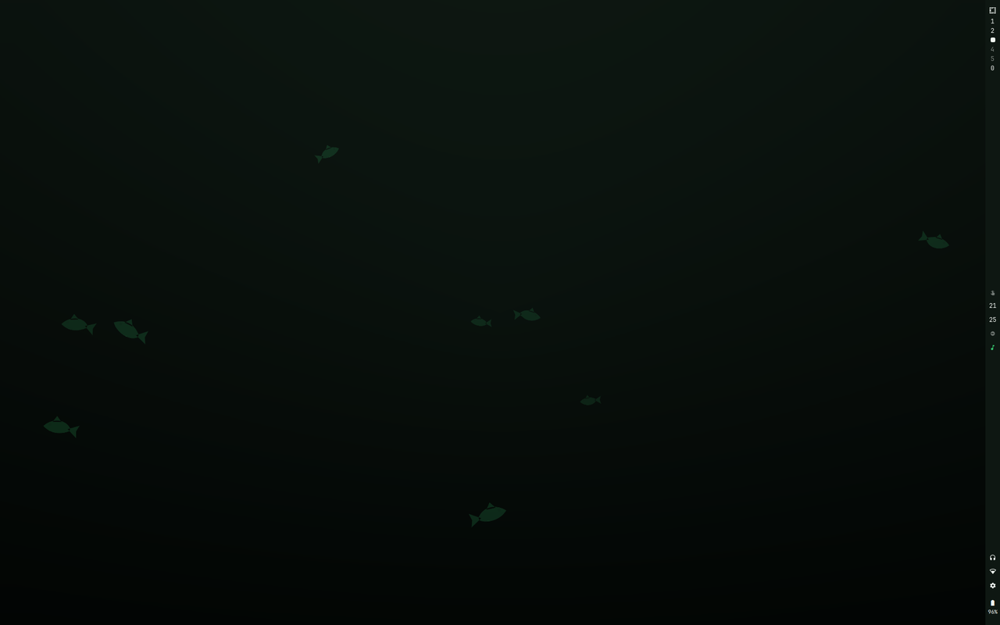

# CodinCod for Omarchy

A dark green desktop. [CodinCod](https://codincod.com)'s own palette, converted
out of oklch so a green here is the same green there.



## Installing it

```bash
omarchy theme install https://github.com/reeveng/codincod-theme.git
```

That is the whole of it. Omarchy takes `colors.toml` and generates the rest, so
this one file re-colours alacritty, foot, kitty, ghostty, btop, helix, neovim,
vscode, chromium, obsidian, the lock screen, Hyprland's borders, the bar, and
the keyboard's own lights.

## Taking it off

```bash
omarchy theme remove codincod
```

## The sea

The wallpaper that used to live in this repository is its own thing now:
[reeveng/seascape](https://github.com/reeveng/seascape). It draws under any
theme, in that theme's two colours, so it is worth having whether or not you
wear this one.

## Making windows opaque

Omarchy fades unfocused windows, and this theme is drawn on the assumption that
nothing is see-through. In `~/.config/hypr/looknfeel.lua`:

```lua
o.window(".*", { opacity = "1 1" })
```

Loaded after Omarchy's defaults, and the last window rule to match is the one
Hyprland keeps.

MIT. See [LICENSE](LICENSE).
